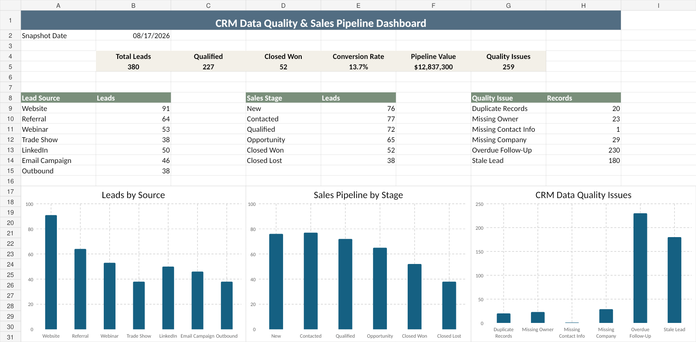

# CRM Data Quality & Sales Pipeline Analysis

## Overview
This portfolio project analyzes a synthetic CRM dataset to identify data-quality problems, pipeline bottlenecks, follow-up gaps, and sales performance trends.

## Dashboard Preview

## Key Findings

- 380 unique leads were identified after duplicate review.
- 227 leads reached qualified status.
- 52 leads converted to Closed Won, resulting in a 13.7% conversion rate.
- The active sales pipeline represents approximately $12.8 million in estimated value.
- The analysis identified CRM quality issues involving duplicate records, missing ownership, incomplete company information, stale leads, and overdue follow-ups.

## Tools
- Microsoft Excel
- Excel formulas and tables
- Data cleaning and standardization
- KPI and dashboard development

## What the analysis covers
- Duplicate CRM records
- Missing lead owners
- Missing contact and company information
- Stale leads
- Overdue follow-ups
- Lead-source volume
- Pipeline stage distribution
- Qualified leads, conversions, conversion rate, and pipeline value

## Files
- `crm_raw_data.csv` — intentionally messy source data
- `crm_data_quality_analysis.xlsx` — raw data, cleaned data, formulas, KPI calculations, and dashboard
- `crm_dashboard_preview.png` — dashboard preview
- `data_dictionary.md` — field definitions

## Skills Demonstrated
CRM data quality, Excel, data cleaning, KPI reporting, sales pipeline analysis, business operations analysis, process improvement, and stakeholder-focused reporting.

> The dataset is synthetic and contains no real customer information.
